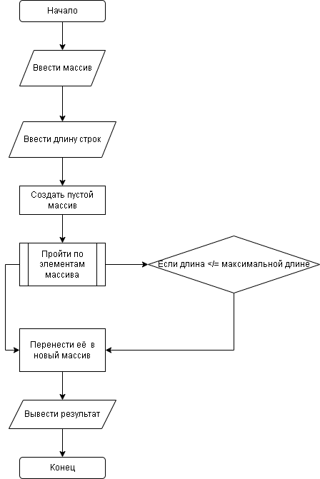

# Контрольная  работа 

## Блок схема для задачи:

1. Получить исходный массив строк.
2. Определить максимальную длину строк (в данном случае это 3 символа).
3. Создать пустой массив для хранения коротких строк.
4.  Пройти по каждому элементу исходного массива.
5. Если длина текущей строки меньше или равна максимальной длине, добавить ее в новый массив.
6. Вывести результат на экран.

 